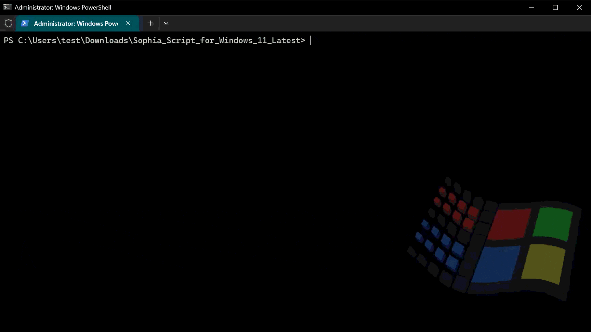
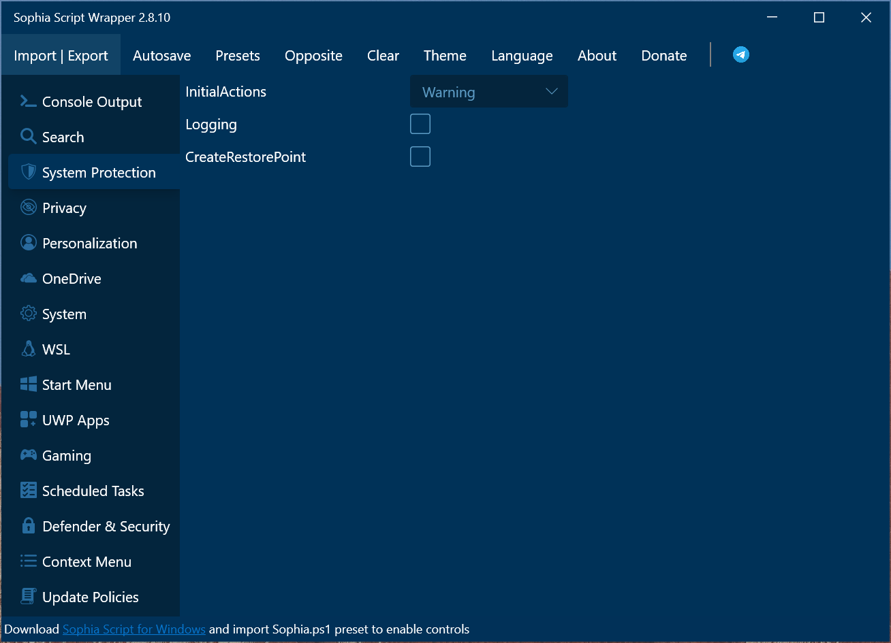
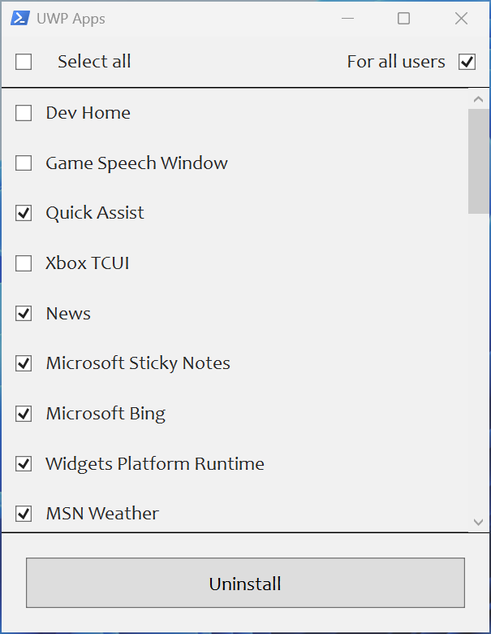
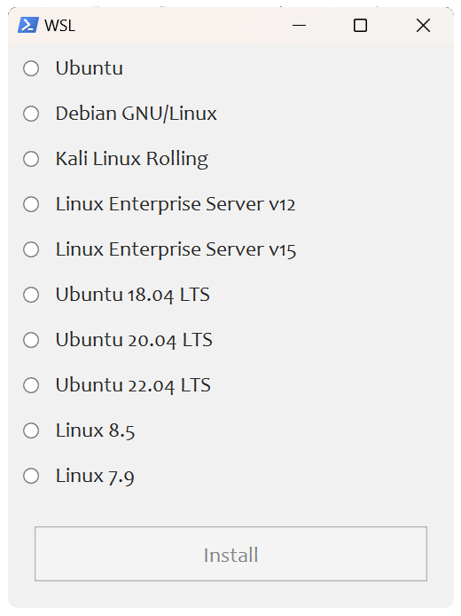
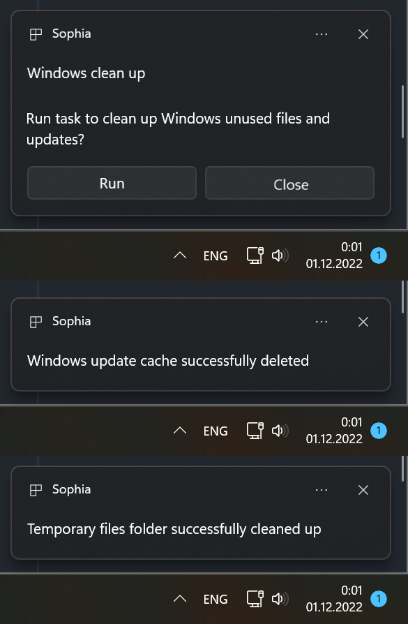

🌐 [English](/README.md) | [Deutsche](/README_de-de.md) | [Русский](/README_ru-ru.md) | [Українська](/README_uk-ua.md)

<div align="center">


# Sophia Script for Windows

Das leistungsstärkste PowerShell-Modul zur Feinabstimmung von Windows auf GitHub

Mit  zu Windows hergestellt

<kbd>
	<a href="https://github.com/farag2/Sophia-Script-for-Windows/actions"></a>
</kbd>
<kbd>
	<a href="https://github.com/farag2/Sophia-Script-for-Windows/releases/latest"></a>
</kbd>
<kbd>
	<a href="https://github.com/farag2/Sophia-Script-for-Windows/releases/latest"></a>
</kbd>

<br>

<kbd>
	<a href="https://github.com/farag2/Sophia-Script-for-Windows/blob/master/.github/workflows/Badge_downloads.yml"></a>
</kbd>
<kbd>
	<a href="https://github.com/farag2/Sophia-Script-for-Windows/blob/master/.github/workflows/Badge_lines.yml"></a>
</kbd>

<br>

<kbd>
	<a href="https://t.me/sophianews"></a>
</kbd>
<kbd>
	<a href="https://t.me/sophia_chat"></a>
</kbd>
<kbd>
	<a href="https://discord.gg/sSryhaEv79"></a>
</kbd>

<br>
<br>

<kbd>
	<a href="https://github.com/farag2/Sophia-Script-for-Windows/releases/latest"></a>
</kbd>

<br>
<br>



</div>

## Haupt-Features

* `Sophia Script for Windows` achtet auf die Stabilität Ihres Windows-Systems und informiert Sie, wenn ein Problem festgestellt wird
* Mehr als 150 einzigartige Funktionen zur Konfiguration von Windows unter Verwendung der offiziell von Microsoft dokumentierten Methoden, ohne das System zu beschädigen.
  * Für jede Änderung in der Voreinstellungsdatei gibt es eine entsprechende Funktion zum Wiederherstellen der Standardeinstellungen
* Konfigurieren Sie Windows AI
* Konfigurieren Sie die Privatsphäre, Sicherheit und Personalisierung von Windows
* Vollständig quelloffenes Projekt
  * Alle Archive werden mit [GitHub Actions](https://github.com/farag2/Sophia-Script-for-Windows/actions) erstellt und hochgeladen
* Verfügbar über Scoop, Chocolatey und WinGet
* ARM64-Unterstützung
* PowerShell 7-Unterstützung
* Es besteht kein Konflikt mit [VAC](https://help.steampowered.com/faqs/view/571A-97DA-70E9-FF74#whatisvac)
* Deinstallieren Sie UWP-Anwendungen, mithilfe der Paketnamen
  * Skript generiert Liste der installierten UWP-Apps [dynamisch](#screenshots)
* Angewandte Registrierungsrichtlinien werden im Snap-In Lokaler Gruppenrichtlinien-Editor (gpedit.msc) angezeigt
* Aktivieren Sie DNS-over-HTTPS mit
  * [Cloudflare DNS](https://developers.cloudflare.com/1.1.1.1/setup/windows/)
  * [Google Public DNS](https://developers.google.com/speed/public-dns/docs/using)
  * [Quad9 DNS](https://quad9.net/service/service-addresses-and-features/)
  * [Comss.one DNS](https://www.comss.ru/page.php?id=7315)
  * [AdGuard DNS](https://adguard-dns.io/public-dns.html)
* OneDrive entfernen
* Interaktive [Eingabeaufforderungen und Popups](#screenshots)
* Die <kbd>TAB</kbd> [Autovervollständigung](#screenshots) für Funktionen und ihre Argumente (mit Import-TabCompletion.ps1)
* Ändern Sie den Speicherort der Benutzerordner (ohne die Benutzerdateien zu verschieben) mithilfe eines interaktiven Menüs
  * Desktop
  * Dokumente
  * Downloads
  * Musik
  * Bilder
  * Videos
* Installieren Sie den kostenlosen (helle und dunkle) "Windows 11 Cursors Concept v2" Cursor von [Jepri Creations](https://www.deviantart.com/jepricreations/art/Windows-11-Cursors-Concept-v2-886489356) on-the-fly
  * Das Archiv wurde mit der [DeviantArt API](https://github.com/farag2/Sophia-Script-for-Windows/blob/master/.github/workflows/Cursors.yml) in den Ordner  [Cursors](https://github.com/farag2/Sophia-Script-for-Windows/tree/master/Cursors) heruntergeladen
* Eine App als Standard für eine bestimmte Dateiendung festlegen, ohne dass das Popup-Fenster `Wie möchten Sie diese Datei öffnen?` angezeigt wird
* Exportieren und importieren Sie alle Windows-Zuordnungen. Sie müssen alle Apps gemäß der exportierten JSON-Datei installieren, um alle Zuordnungen wiederherzustellen
* Installieren Sie die WSL-Linux-Distribution mit Popup-Fenster(#screenshots) unter Verwendung benutzerfreundlicher Distributionsnamen
* Erstellen Sie geplante Aufgaben mit einer [nativen Toast-Benachrichtigung](#screenshots)
  * Erstellen Sie die geplanten Aufgaben `Windows Cleanup` und `Windows Cleanup Notification`, um Windows von ungenutzten Dateien und Windows-Updates zu bereinigen
  * Erstellen Sie eine geplante Aufgabe `SoftwareDistribution` zur Bereinigung von `%SystemRoot%\SoftwareDistribution\Download`
  * Erstellen Sie eine geplante Aufgabe `Temp` zum Aufräumen von `%TEMP%`
* Installieren Sie die neueste bereitgestellte Version von Microsoft Visual C++ 2015–2026 x86/x64
* Installieren Sie die neueste bereitgestellte Version von .NET Desktop Runtime 8, 9, 10
* Viele weitere Optimierungen für den Datei-Explorer und das Kontextmenü

## Inhaltsverzeichnis

* [Haupt-Features](#haupt-features)
* [Wie kann man herunterladen](#wie-kann-man-herunterladen)
* [Wie zu verwenden](#wie-zu-verwenden)
  * [Verwendung von spezifischen Funktionen](#verwendung-von-spezifischen-funktionen)
* [System-Voraussetzungen](#system-voraussetzungen)
* [Screenshots](#screenshots)
* [Wie man übersetzt](#wie-man-übersetzt)
* [SophiApp 2.0](#sophiapp-20-c--winui-3)

## Wie kann man herunterladen

### Von der GitHub-Versionsseite

<table>
  <tbody>
    <tr>
      <td align="center">Windows 10</td>
      <td align="center">Windows 11</td>
    </tr>
    <tr>
      <td align="left"><a href="https://github.com/farag2/Sophia-Script-for-Windows/releases/latest"></a></td>
      <td align="left"><a href="https://github.com/farag2/Sophia-Script-for-Windows/releases/latest"></a></td>
    </tr>
    <tr>
      <td align="left"><a href="https://github.com/farag2/Sophia-Script-for-Windows/releases/latest"></a></td>
      <td align="left"><a href="https://github.com/farag2/Sophia-Script-for-Windows/releases/latest"></a></td>
    </tr>
    <tr>
      <td align="left"><a href="https://github.com/farag2/Sophia-Script-for-Windows/releases/latest"></a></td>
      <td align="left"><a href="https://github.com/farag2/Sophia-Script-for-Windows/releases/latest"></a></td>
    </tr>
    <tr>
      <td align="left"><a href="https://github.com/farag2/Sophia-Script-for-Windows/releases/latest"></a></td>
      <td align="left"><a href="https://github.com/farag2/Sophia-Script-for-Windows/releases/latest"></a></td>
    </tr>
    <tr>
      <td align="left"></td>
      <td align="left"><a href="https://github.com/farag2/Sophia-Script-for-Windows/releases/latest"></a></td>
    </tr>
    <tr>
      <td align="center" colspan="2"><a href="https://github.com/farag2/Sophia-Script-for-Windows/releases/latest"></a></td>
    </tr>
  </tbody>
</table>

### Herunterladen über PowerShell

Laden Sie die neueste Version von `Sophia Script for Windows` entsprechend Ihrer Windows- und PowerShell-Version herunter und entpacken Sie sie in den Ordner Downloads.

```powershell
iwr script.sophia.team -useb | iex
```

Laden Sie die neueste Version von `Sophia Script for Windows` aus dem letzten [Commit](https://github.com/farag2/Sophia-Script-for-Windows/commits/master/) entsprechend Ihrer Windows- und PowerShell-Version herunter und entpacken Sie sie in den Ordner Downloads.

```powershell
iwr sl.sophia.team -useb | iex
```

### Chocolatey

Laden Sie die neueste Version von `Sophia Script for Windows` entsprechend Ihrer Windows-Version herunter und entpacken Sie sie in den Ordner Downloads.

```powershell
choco install sophia --force -y
```

Laden Sie die neueste Version von `Sophia Script for Windows` für PowerShell 7 entsprechend Ihrer Windows-Version herunter und entpacken Sie sie in den Ordner Downloads.

```powershell
choco install sophia --params "/PS7" --force -y
```

```powershell
# Deinstallieren Sie die Anwendung und löschen Sie anschließend den heruntergeladenen Ordner manuell
choco uninstall sophia --force -y
```

### WinGet

Laden Sie die neueste Version von `Sophia Script for Windows` für Windows 11 und PowerShell 5.1 (SFX-Archiv `sophiascript.exe`) herunter und entpacken Sie sie in den Ordner Downloads.

```powershell
$DownloadsFolder = Get-ItemPropertyValue -Path "HKCU:\Software\Microsoft\Windows\CurrentVersion\Explorer\User Shell Folders" -Name "{374DE290-123F-4565-9164-39C4925E467B}"
winget install --id TeamSophia.SophiaScript --location $DownloadsFolder --accept-source-agreements --force

& "$DownloadsFolder\sophiascript.exe"
```

```powershell
# Deinstallieren Sie Sophia Script for Windows
winget uninstall --id TeamSophia.SophiaScript --force
```

### Scoop

Laden Sie die neueste Version von `Sophia Script for Windows` für Windows 11 für PowerShell 5.1 herunter und entpacken Sie sie in den Ordner Downloads.

```powershell
# scoop bucket rm extras
scoop bucket add extras
scoop install sophia-script --no-cache
```

```powershell
# Deinstallieren Sie Sophia Script for Windows
scoop uninstall sophia-script --purge
```

## Wie zu verwenden

<https://github.com/user-attachments/assets/5af5c234-5fb5-4e7e-a3d0-ae496a89e6ba>

* Laden Sie das Archiv für Ihr System herunter und entpacken Sie es.
* Schauen Sie sich die Datei `Sophia.ps1` an, um die Funktionen zu konfigurieren, die Sie ausführen möchten
  * Setzen Sie das `#`-Zeichen vor die Funktion, wenn Sie nicht möchten, dass sie ausgeführt wird
  * Entfernen Sie das `#`-Zeichen vor der Funktion, wenn sie ausgeführt werden soll
* Klicken Sie mit der rechten Maustaste auf die Schaltfläche `Windows`, öffnen Sie das Terminal (PowerShell) als Administrator und fügen Sie den kopierten Pfad zum Ordner ein

```batch
  cd pfad\zum\ordner
```

* Legen Sie die Ausführungsrichtlinie so fest, dass Skripte nur in der aktuellen PowerShell-Sitzung ausgeführt werden können

```powershell
  Set-ExecutionPolicy -ExecutionPolicy Bypass -Scope Process -Force
```

* Geben Sie `.\Sophia.ps1` ein und drücken Sie <kbd>Enter</kbd>

### Verwendung von spezifischen Funktionen

<https://github.com/user-attachments/assets/d70150d6-af8c-4933-9ec5-b2cf3bb1dd34>

* Führen Sie alle Schritte aus dem Abschnitt [Wie zu verwenden](#wie-zu-verwenden) aus und stoppen Sie bei den Einstellungen der Ausführungsrichtlinie in PowerShell.
* Um spezifische Funktionen auszuführen [dot source](https://learn.microsoft.com/en-us/powershell/module/microsoft.powershell.core/about/about_operators#dot-sourcing-operator-) die `Import-TabCompletion.ps1` datei zuerst:

```powershell
# With a dot at the beginning
. .\Import-TabCompletion.ps1
```

* Rufen Sie jede Skriptfunktion mit Namensautokomplettierung über die <kbd>TAB</kbd>-Taste auf.

```powershell
Sophia -Functions<TAB>
Sophia -Functions temp<TAB>
Sophia -Functions unin<TAB>
Sophia -Functions uwp<TAB>
Sophia -Functions "DiagTrackService -Disable", "DiagnosticDataLevel -Minimal", Uninstall-UWPApps

Uninstall-UWPApps, "PinToStart -UnpinAll"
```

## Wrapper



Wrapper ist ein Closed-Source-Wrapper eines Drittanbieters für `Sophia Script for Windows”. Er wird vollständig von [@BenchTweakGaming](https://github.com/BenchTweakGaming) gepflegt.

Lesen Sie [hier mehr dazu](./Wrapper/README.md)

## System-Voraussetzungen

[Windows-10]: https://support.microsoft.com/topic/windows-10-update-history-8127c2c6-6edf-4fdf-8b9f-0f7be1ef3562
[Windows-10-LTSC-2019]: https://support.microsoft.com/topic/windows-10-and-windows-server-2019-update-history-725fc2e1-4443-6831-a5ca-51ff5cbcb059
[Windows-10-LTSC-2021]: https://support.microsoft.com/topic/windows-10-update-history-857b8ccb-71e4-49e5-b3f6-7073197d98fb
[Windows-11-LTSC-2024]: https://support.microsoft.com/topic/windows-11-version-24h2-update-history-0929c747-1815-4543-8461-0160d16f15e5
[Windows-11-24h2]: https://support.microsoft.com/topic/windows-11-version-25h2-update-history-99c7f493-df2a-4832-bd2d-6706baa0dec0

|               Version                    |                Build                  |      Edition        |
|:-----------------------------------------|:-------------------------------------:|:-------------------:|
| Windows 11 24H2/25H2+                    | [Latest stable][Windows-11-24h2]      | Home/Pro/Enterprise |
| Windows 10 x64 22H2                      | [Latest stable][Windows-10]           | Home/Pro/Enterprise |
| Windows 11 Enterprise LTSC 2024          | [Latest stable][Windows-11-LTSC-2024] | Enterprise          |
| Windows 10 x64 21H2 Enterprise LTSC 2021 | [Latest stable][Windows-10-LTSC-2021] | Enterprise          |
| Windows 10 x64 1809 Enterprise LTSC 2019 | [Latest stable][Windows-10-LTSC-2019] | Enterprise          |

## Screenshots

<div class="row">
  
  
</div>



## Wie man übersetzt

* Holen Sie sich die Sprache der Benutzeroberfläche Ihres Betriebssystems, indem Sie "$PSUICulture" in PowerShell aufrufen
* Erstellen Sie einen Ordner mit dem Namen der UI-Sprache
* Legen Sie Ihre lokalisierte SophiaScript.psd1-Datei in diesen Ordner.

## Media

<details>
<a href="https://www.xda-developers.com/sophia-script-returns-control-windows-11">XDA</a>

<a href="https://4sysops.com/archives/windows-10-sophia-script-powershell-functions-for-windows-10-fine-tuning-and-automating-routine-configuration-tasks/">4sysops</a>

<a href="https://www.ghacks.net/2020/09/27/windows-10-setup-script-has-a-new-name-and-is-now-easier-to-use/">gHacks</a>

<a href="https://www.neowin.net/news/this-windows-10-setup-script-lets-you-fine-tune-around-150-functions-for-new-installs">Neowin</a>

<a href="https://www.comss.ru/page.php?id=8019">Comss.ru</a>

<a href="https://habr.com/company/skillfactory/blog/553800">Habr</a>

<a href="https://www.deskmodder.de/blog/2021/08/07/sophia-script-for-windows-jetzt-fuer-windows-11-und-10/)">Deskmodder.de</a>

<a href="https://forum.ru-board.com/topic.cgi?forum=62&topic=30617#15">Ru-Board</a>

<a href="https://rutracker.org/forum/viewtopic.php?t=5996011">rutracker</a>

<a href="https://forums.mydigitallife.net/threads/powershell-windows-10-sophia-script.81675/">My Digital Life</a>
</details>

***

## SophiApp 2.0 (C# + WinUI 3)

[SophiApp 2.0](https://github.com/Sophia-Community/SophiApp) befindet sich in der Entwicklung. 🚀


