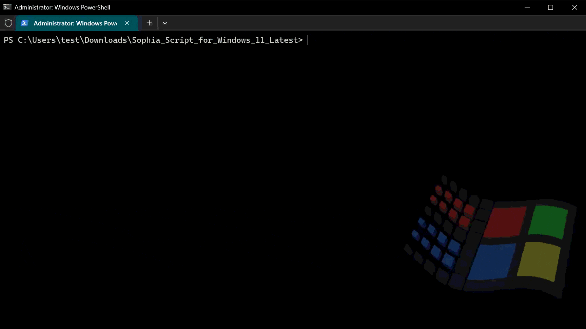
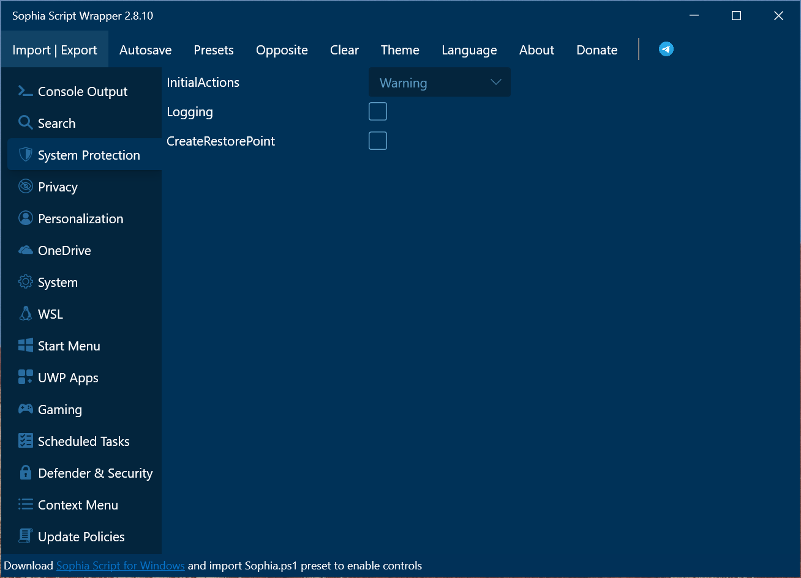
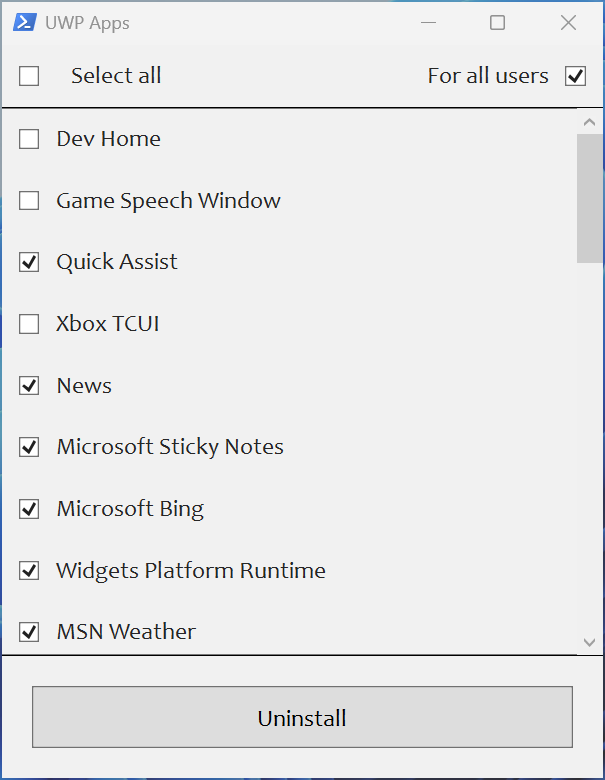
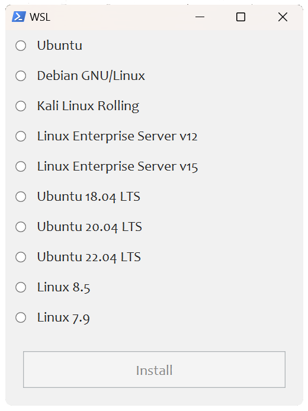
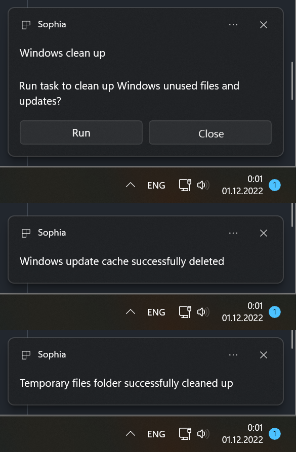

🌐 [English](/README.md) | [Deutsche](/README_de-de.md) | [Русский](/README_ru-ru.md) | [Українська](/README_uk-ua.md)

<div align="center">


# Sophia Script for Windows

Найпотужніший PowerShell-модуль на GitHub для тонкого налаштування Windows

Зроблено з  до Windows

<kbd>
	<a href="https://github.com/farag2/Sophia-Script-for-Windows/actions"></a>
</kbd>
<kbd>
	<a href="https://github.com/farag2/Sophia-Script-for-Windows/releases/latest"></a>
</kbd>
<kbd>
	<a href="https://github.com/farag2/Sophia-Script-for-Windows/releases/latest"></a>
</kbd>

<br>

<kbd>
	<a href="https://github.com/farag2/Sophia-Script-for-Windows/blob/master/.github/workflows/Badge_downloads.yml"></a>
</kbd>
<kbd>
	<a href="https://github.com/farag2/Sophia-Script-for-Windows/blob/master/.github/workflows/Badge_lines.yml"></a>
</kbd>

<br>

<kbd>
	<a href="https://t.me/sophianews"></a>
</kbd>
<kbd>
	<a href="https://t.me/sophia_chat"></a>
</kbd>
<kbd>
	<a href="https://discord.gg/sSryhaEv79"></a>
</kbd>

<br>
<br>

<kbd>
	<a href="https://github.com/farag2/Sophia-Script-for-Windows/releases/latest"></a>
</kbd>

<br>
<br>



</div>

## Ключові особливості

* `Sophia Script for Windows` дбає про стабільність вашої Windows і повідомить вас у разі виявлення проблеми
* Понад 150 унікальних функцій для налаштування Windows з використанням офіційно задокументованих методів Microsoft без шкоди для системи
  * Кожне налаштування має відповідну функцію для відновлення значень за замовчуванням
* Проект с полностью открытым исходным кодом
  * Всі архіви збираються і завантажуються на сторінку релізів, [використовуючи GitHub Actions](https://github.com/farag2/Sophia-Script-for-Windows/actions)
* Налаштування Windows AI
* Налаштування приватності, безпеки та персоналізації Windows
* Доступний через Scoop, Chocolatey та WinGet
* Підтримка ARM64
* Підтримка PowerShell 7
* Не конфліктує з [VAC](https://help.steampowered.com/faqs/view/571A-97DA-70E9-FF74#whatisvac)
* Видалення UWP-додатків, що відображають назви пакетів
  * Скрипт генерує список встановлених UWP-додатків [динамічно](#скріншоти)
* Застосовані політики реєстру будуть відображатися в оснащенні редагування групових політик (gpedit.msc)
* Встановити на вибір наступні DNS-провайдери, використовуючи DNS-over-HTTPS
  * [Cloudflare DNS](https://developers.cloudflare.com/1.1.1.1/setup/windows/)
  * [Google Public DNS](https://developers.google.com/speed/public-dns/docs/using)
  * [Quad9 DNS](https://quad9.net/service/service-addresses-and-features/)
  * [Comss.one DNS](https://www.comss.ru/page.php?id=7315)
  * [AdGuard DNS](https://adguard-dns.io/public-dns.html)
* Видалення OneDrive
* Інтерактивні [підказки та спливаючі вікна](#скріншоти)
* <kbd>TAB</kbd> [доповнення](#як-запустити-певну-функціюї) для функцій та їх аргументів (Використовуючи Import-TabCompletion.ps1)
* Змінити розташування папок користувача (без переміщення файлів користувача) за допомогою інтерактивного меню
  * Робочий стіл
  * Документи
  * Завантаження
  * Музика
  * Зображення
  * Відео
* Встановлення безкоштовних (світлий та темний) курсорів "Windows 11 Cursors Concept v2" від [Jepri Creations](https://www.deviantart.com/jepricreations/art/Windows-11-Cursors-Concept-v2-886489356) на льоту
  * Архів був завантажений у папку [Cursors](https://github.com/farag2/Sophia-Script-for-Windows/tree/master/Cursors), за допомогою [DeviantArt API](https://github.com/farag2/Sophia-Script-for-Windows/blob/master/.github/workflows/Cursors.yml)
* Реєстрація програми, розрахунок хешу та встановлення за замовчуванням для певного розширення без спливаючого вікна `Як ви хочете відкрити це`
* Експортувати та імпортувати всі асоціації в Windows. Необхідно встановити всі програми відповідно до експортованого файлу JSON, щоб відновити асоціації.
* Створити завдання в Планувальнику завдань з [нативним тостовим повідомленням](#скріншоти)
  * Створити завдання з нативним тостовим повідомленням, де ви зможете запустити або скасувати [виконання](#скріншоти) завдання
  * Створити завдання `Windows Cleanup` и `Windows Cleanup Notification` для очищення Windows від невикористовуваних файлів та оновлень
  * Створити завдання `SoftwareDistribution` для очищення `%SystemRoot%\SoftwareDistribution\Download`
  * Створити завдання `Temp` для очищення `%TEMP%`
* Встановити останню версію розповсюджуваних пакетів Microsoft Visual C++ 2015–2026 x86/x64
* Встановити останню версію розповсюджуваних пакетів .NET Desktop Runtime 8, 9, 10 x64
* Ще багато налаштувань Файлового Провідника та контекстного меню

## Зміст

* [Ключові особливості](#ключові-особливості)
* [Як завантажити](#як-завантажити)
* [Як використовувати](#як-використовувати)
  * [Як запустити певну функцію(ї)](#як-запустити-певну-функціюї)
  * [Wrapper](#wrapper)
* [Системні вимоги](#системні-вимоги)
* [Скріншоти](#скріншоти)
* [Як перекласти](#як-перекласти)
* [Медіа](#медіа)
* [SophiApp 2.0](#sophiapp-20-c--winui-3)

## Як завантажити

### Зі сторінки релізу

<table>
  <tbody>
    <tr>
      <td align="center">Windows 10</td>
      <td align="center">Windows 11</td>
    </tr>
    <tr>
      <td align="left"><a href="https://github.com/farag2/Sophia-Script-for-Windows/releases/latest"></a></td>
      <td align="left"><a href="https://github.com/farag2/Sophia-Script-for-Windows/releases/latest"></a></td>
    </tr>
    <tr>
      <td align="left"><a href="https://github.com/farag2/Sophia-Script-for-Windows/releases/latest"></a></td>
      <td align="left"><a href="https://github.com/farag2/Sophia-Script-for-Windows/releases/latest"></a></td>
    </tr>
    <tr>
      <td align="left"><a href="https://github.com/farag2/Sophia-Script-for-Windows/releases/latest"></a></td>
      <td align="left"><a href="https://github.com/farag2/Sophia-Script-for-Windows/releases/latest"></a></td>
    </tr>
    <tr>
      <td align="left"><a href="https://github.com/farag2/Sophia-Script-for-Windows/releases/latest"></a></td>
      <td align="left"><a href="https://github.com/farag2/Sophia-Script-for-Windows/releases/latest"></a></td>
    </tr>
    <tr>
      <td align="left"></td>
      <td align="left"><a href="https://github.com/farag2/Sophia-Script-for-Windows/releases/latest"></a></td>
    </tr>
    <tr>
      <td align="center" colspan="2"><a href="https://github.com/farag2/Sophia-Script-for-Windows/releases/latest"></a></td>
    </tr>
  </tbody>
</table>

### Завантажити через PowerShell

Завантажте та розпакуйте в папку Завантаження останню версію `Sophia Script for Windows` залежно від версій ваших Windows та PowerShell.

```powershell
iwr script.sophia.team -useb | iex
```

Завантажте та розпакуйте в папку Завантаження останню версію `Sophia Script for Windows` з актуального [коміту](https://github.com/farag2/Sophia-Script-for-Windows/commits/master/) залежно від версій ваших Windows і PowerShell.

```powershell
iwr sl.sophia.team -useb | iex
```

### Chocolatey

Завантажте та розпакуйте в папку Завантаження останню версію `Sophia Script for Windows` залежно від вашої версії Windows.

```powershell
choco install sophia --version=7.1.4 --force --yes
```

Завантажте та розпакуйте в папку Завантаження останню версію `Sophia Script for Windows` для PowerShell 7 залежно від вашої версії Windows.

```powershell
choco install sophia --version=7.1.4 --params "/PS7" --force --yes
```

```powershell
# Видалити, а потім видалити вручну завантажену папку
choco uninstall sophia --force --yes
```

### WinGet

Завантажте та розпакуйте в папку Завантаження останню версію `Sophia Script for Windows` для Windows 11 і PowerShell 5.1 (SFX-архів `sophiascript.exe`).

```powershell
$DownloadsFolder = Get-ItemPropertyValue -Path "HKCU:\Software\Microsoft\Windows\CurrentVersion\Explorer\User Shell Folders" -Name "{374DE290-123F-4565-9164-39C4925E467B}"
winget install --id TeamSophia.SophiaScript --location $DownloadsFolder --accept-source-agreements --force

& "$DownloadsFolder\sophiascript.exe"
```

```powershell
# Видалити Sophia Script for Windows
winget uninstall --id TeamSophia.SophiaScript --force
```

### Scoop

Завантажте та розпакуйте в папку Завантаження останню версію `Sophia Script for Windows` для Windows 11 та PowerShell 5.1.

```powershell
# scoop bucket rm extras
scoop bucket add extras
scoop install sophia-script --no-cache
```

```powershell
# Видалити Sophia Script for Windows
scoop uninstall sophia-script --purge
```

## Як використовувати

<https://github.com/user-attachments/assets/5af5c234-5fb5-4e7e-a3d0-ae496a89e6ba>

* Завантажте та розпакуйте архів для вашої системи
* Перегляньте файл `Sophia.ps1` для налаштування функцій, які потрібно запустити
  * Помістіть символ `#` перед функцією, якщо ви не бажаєте, щоб вона виконувалась
  * Приберіть символ `#` перед функцією, якщо ви бажаєте, щоб вона виконувалась
* Скопіюйте шлях до папки `Sophia Script for Windows`
* Клацніть правою кнопкою миші на кнопці `Windows` і відкрийте Термінал (PowerShell) від імені адміністратора та вставте скопійований шлях

```batch
  cd путь\до\папки
```

* Встановіть політику виконання, щоб можна було виконувати скрипти в поточній сесії PowerShell

```powershell
  Set-ExecutionPolicy -ExecutionPolicy Bypass -Scope Process -Force
```

* Введіть `.\Sophia.ps1` і натисніть <kbd>Enter</kbd>

### Як запустити певну функцію(ї)

<https://github.com/user-attachments/assets/d70150d6-af8c-4933-9ec5-b2cf3bb1dd34>

* Повторіть усі кроки з розділу [Як використовувати](#як-використовувати) і зупиніться на кроці встановлення політики виконання скриптів у `PowerShell`
* Для запуску певної функції(й) [запустити](https://learn.microsoft.com/en-us/powershell/module/microsoft.powershell.core/about/about_operators#dot-sourcing-operator-) необхідно запустити файл `Import-TabCompletion.ps1`:

```powershell
# З крапкою на початку
. .\Import-TabCompletion.ps1
```

* Викличте будь-яку функцію зі скрипта з використанням автопродовження імені за допомогою <kbd>TAB</kbd>.

```powershell
Sophia -Functions<TAB>
Sophia -Functions temp<TAB>
Sophia -Functions unin<TAB>
Sophia -Functions uwp<TAB>
Sophia -Functions "DiagTrackService -Disable", "DiagnosticDataLevel -Minimal", Uninstall-UWPApps

Uninstall-UWPApps, "PinToStart -UnpinAll"
```

## Wrapper



Wrapper — це сторонній лончер із закритим вихідним кодом для `Sophia Script for Windows`. Проект повністю підтримується [@BenchTweakGaming](https://github.com/BenchTweakGaming).

Детальніше [тут](./Wrapper/README.md)

## Системні вимоги

[Windows-10]: https://support.microsoft.com/topic/windows-10-update-history-8127c2c6-6edf-4fdf-8b9f-0f7be1ef3562
[Windows-10-LTSC-2019]: https://support.microsoft.com/topic/windows-10-and-windows-server-2019-update-history-725fc2e1-4443-6831-a5ca-51ff5cbcb059
[Windows-10-LTSC-2021]: https://support.microsoft.com/topic/windows-10-update-history-857b8ccb-71e4-49e5-b3f6-7073197d98fb
[Windows-11-LTSC-2024]: https://support.microsoft.com/topic/windows-11-version-24h2-update-history-0929c747-1815-4543-8461-0160d16f15e5
[Windows-11-24h2]: https://support.microsoft.com/topic/windows-11-version-25h2-update-history-99c7f493-df2a-4832-bd2d-6706baa0dec0

|                Версія                    |                 Збіркa                   |       Видання       |
|:-----------------------------------------|:----------------------------------------:|:-------------------:|
| Windows 11 24H2/25H2+                    | [Остання стабільн][Windows-11-24h2]      | Home/Pro/Enterprise |
| Windows 10 x64 22H2                      | [Остання стабільн][Windows-10]           | Home/Pro/Enterprise |
| Windows 11 Enterprise LTSC 2024          | [Остання стабільн][Windows-11-LTSC-2024] | Enterprise          |
| Windows 10 x64 21H2 Enterprise LTSC 2021 | [Остання стабільн][Windows-10-LTSC-2021] | Enterprise          |
| Windows 10 x64 1809 Enterprise LTSC 2019 | [Остання стабільн][Windows-10-LTSC-2019] | Enterprise          |

## Скріншоти

<div class="row">
  
  
</div>



## Як перекласти

* Виконайте команду `$PSUICulture` в PowerShell, щоб визначити мову інтерфейсу
* Створіть папку з назвою Вашої мови інтерфейсу (наприклад, `uk-UA`)
* Помістіть ваш локалізований файл SophiaScript.psd1 в цю папку

## Медіа

<details>

<a href="https://www.comss.ru/page.php?id=19917">Comss.ru</a>

<a href="https://www.windowscentral.com/microsoft/windows-11/how-to-fine-tune-your-pc-with-the-sophia-script-for-windows-11">Windows Central</a>

<a href="https://www.xda-developers.com/sophia-script-returns-control-windows-11">XDA</a>

<a href="https://www.neowin.net/news/this-script-is-the-ultimate-tool-to-control-and-customize-windows-11">Neowin</a>

<a href="https://www.neowin.net/news/this-windows-10-setup-script-lets-you-fine-tune-around-150-functions-for-new-installs">Neowin 2</a>

<a href="https://4sysops.com/archives/windows-10-sophia-script-powershell-functions-for-windows-10-fine-tuning-and-automating-routine-configuration-tasks/">4sysops</a>

<a href="https://www.ghacks.net/2020/09/27/windows-10-setup-script-has-a-new-name-and-is-now-easier-to-use/">gHacks</a>

<a href="https://www.comss.ru/page.php?id=8019">Comss.ru 2</a>

<a href="https://habr.com/company/skillfactory/blog/553800">Habr</a>

<a href="https://www.deskmodder.de/blog/2021/08/07/sophia-script-for-windows-jetzt-fuer-windows-11-und-10/)">Deskmodder.de</a>

<a href="https://forum.ru-board.com/topic.cgi?forum=62&topic=30617#15">Ru-Board</a>

<a href="https://rutracker.org/forum/viewtopic.php?t=5996011">rutracker</a>

<a href="https://forums.mydigitallife.net/threads/powershell-windows-10-sophia-script.81675/">My Digital Life</a>
</details>

***

## SophiApp 2.0 (C# + WinUI 3)

[SophiApp](https://github.com/Sophia-Community/SophiApp) перебуває в активній розробці. 🚀


