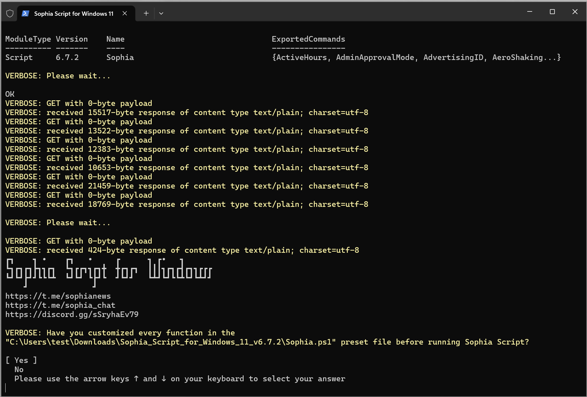

<div align="center">


# Sophia Script for Windows

**Sophia Script für Windows ist das leistungsstärkste PowerShell-Modul zur Feinabstimmung von Windows**

[downloads-badge]: https://img.shields.io/endpoint?url=https://gist.githubusercontent.com/farag2/25ddc72387f298503b752ad5b8d16eed/raw/SophiaScriptDownloadsCount.json
[lines-badge]: https://img.shields.io/endpoint?url=https://gist.githubusercontent.com/farag2/9852d6b9569a91bf69ceba8a94cc97f4/raw/SophiaScript.json
[lines-link]: https://github.com/farag2/Sophia-Script-for-Windows/blob/master/.github/workflows/Badge_lines.yml
[badge-code]: https://github.com/farag2/Sophia-Script-for-Windows/blob/master/.github/workflows/Badge_downloads.yml

[![downloads][downloads-badge]][badge-code]
[![lines][lines-badge]][lines-link]

[telegram-news-badge]: https://img.shields.io/badge/Sophia%20News-Telegram-blue?style=flat&logo=Telegram
[telegram-news]: https://t.me/sophianews
[telegram-group]: https://t.me/sophia_chat
[telegram-group-badge]: https://img.shields.io/endpoint?color=neon&label=Sophia%20Chat&style=flat&url=https%3A%2F%2Ftg.sumanjay.workers.dev%2Fsophia_chat
[discord-news-badge]: https://discordapp.com/api/guilds/1006179075263561779/widget.png?style=shield
[discord-link]: https://discord.gg/sSryhaEv79

[![Telegram][telegram-news-badge]][telegram-news]
[![Telegram][telegram-group-badge]][telegram-group]
[![Discord][discord-news-badge]][discord-link]

[](https://github.com/farag2/Sophia-Script-for-Windows/actions)
[](https://github.com/farag2/Sophia-Script-for-Windows/releases/latest)

[](../README.md)
[](./README_uk-ua.md)
[](./README_ru-ru.md)



</div>

## About Sophia Script

`Sophia Script for Windows` ist das größte PowerShell-Modul auf `GitHub` für `Windows 10` & `Windows 11` zur Feinabstimmung und Automatisierung von Routineaufgaben. Es bietet mehr als 150 einzigartige Tweaks und zeigt, wie Windows konfiguriert werden kann, ohne Windows dabei zu schaden.

Mit  zu Windows gemacht.

> [!IMPORTANT]
> Für jede Änderung in der Voreinstellungsdatei gibt es eine entsprechende Funktion zum Wiederherstellen der Standardeinstellungen. Das Skript sollte am besten auf einem frisch installierten System ausgeführt werden, da die Ausführung auf einem falsch getweakten System zu Fehlern führen kann.

> [!WARNING]
> Es darf nur ein Admin-Benutzer während des Starts der Anwendung angemeldet sein.
>
> `Sophia Script for Windows` funktioniert möglicherweise nicht auf einem selbstgebauten Windows. Insbesondere, wenn das Homebrew-Image von Betriebssystemherstellern erstellt wurde, die Microsoft Defender zerstören und die Telemetrie des Betriebssystems deaktivieren, indem sie absichtlich Systemkomponenten "uprooten".

## Table of Contents

* [Wie kann man herunterladen](#wie-kann-man-herunterladen)
  * [Herunterladen über PowerShell](#herunterladen-über-powershell)
  * [Herunterladen über Chocolatey](#herunterladen-über-chocolatey)
  * [Herunterladen über WinGet](#herunterladen-über-winget)
  * [Von der GitHub-Versionsseite](#von-der-github-versionsseite)
* [Wie zu verwenden](#wie-zu-verwenden)
  * [Verwendung von spezifischen Funktionen](#verwendung-von-spezifischen-funktionen)
  * [Wrapper](#wrapper)
  * [Wie man Änderungen rückgängig macht](#wie-man-änderungen-rückgängig-macht)
* [Spenden](#spenden)
* [System-Voraussetzungen](#system-voraussetzungen)
* [Haupt-Features](#haupt-features)
* [Screenshots](#screenshots)
* [Videos](#videos)
* [Wie man übersetzt](#wie-man-übersetzt)
* [Media](#media)
* [SophiApp 2](#sophiapp-2-c--winui-3)

## Wie kann man herunterladen

### Herunterladen über PowerShell

Der Befehl lädt das neueste Sophia Script-Archiv herunter und extrahiert es (`ohne Ausführung`) entsprechend der Windows- und PowerShell-Version, unter der er ausgeführt wird. Wenn Sie es z. B. unter Windows 11 über PowerShell 5.1 ausführen, wird Sophia Script für `Windows 11 PowerShell 5.1` heruntergeladen.

```powershell
iwr script.sophia.team -useb | iex
```

Der Befehl lädt das neueste Sophia Script-Archiv (`ohne es auszuführen`) aus dem letzten verfügbaren Commit herunter und erweitert es, je nachdem, auf welchen Windows- und PowerShell-Versionen es ausgeführt wird.

```powershell
iwr sl.sophia.team -useb | iex
```

### Herunterladen über Chocolatey

Der Befehl lädt das neueste Sophia Script-Archiv herunter und erweitert es (`ohne es auszuführen)`, je nachdem, unter welchem Windows er ausgeführt wird. Wenn Sie ihn unter Windows 11 ausführen, wird Sophia Script für `Windows 11` heruntergeladen. Für `PowerShell 5.1` ist standardmäßig nichts anderes angegeben.

```powershell
choco install sophia --force -y
```

Download `Sophia Script for Windows` for `PowerShell 7`.

```powershell
choco install sophia --params "/PS7" --force -y
```

```powershell
# Deinstallieren Sie Sophia Script
# Dann entfernen Sie den heruntergeladenen Ordner manuell
choco uninstall sophia --force -y
```

### Herunterladen über WinGet

Der Befehl lädt im Gegensatz zum [Chocolatey-Skriptscript](#herunterladen-über-chocolatey) nur das `Windows 11 (PowerShell 5.1)-Archiv` in Ihren `Downloads-Ordner` herunter und erweitert es.

```powershell
$DownloadsFolder = Get-ItemPropertyValue -Path "HKCU:\Software\Microsoft\Windows\CurrentVersion\Explorer\User Shell Folders" -Name "{374DE290-123F-4565-9164-39C4925E467B}"
winget install --id TeamSophia.SophiaScript --location $DownloadsFolder --accept-source-agreements --force
```

```powershell
# Deinstallieren Sie Sophia Script
winget uninstall --id TeamSophia.SophiaScript --force
```

### Von der GitHub-Versionsseite

* Laden Sie ein [Archiv](https://github.com/farag2/Sophia-Script-for-Windows/releases/latest) entsprechend Ihrer Windows- und PowerShell-Version herunter.

## Wie zu verwenden

* Archiv herunterladen und erweitern;
* Das Archiv extrahieren;
* Schauen Sie sich die Datei `Sophia.ps1` an, um die Funktionen zu konfigurieren, die Sie ausführen möchten;
  * Setzen Sie das `#`-Zeichen vor die Funktion, wenn Sie nicht möchten, dass sie ausgeführt wird.
  * Entfernen Sie das `#`-Zeichen vor der Funktion, wenn sie ausgeführt werden soll.
* Kopieren Sie den gesamten Pfad zu `Sophia.ps1`.
  * Mit `Windows 10` drücke und halte die <kbd>Shift</kbd> Taste, Rechtsklick auf `Sophia.ps1`, anschließend `als Pfad kopieren` auswählen;
  * Mit `Windows 11` Rechtsklick auf `Sophia.ps1` und `als Pfad kopieren` auswählen.
* Öffnen Sie `Windows PowerShell`
  * Klicken Sie unter `Windows 10` im Datei-Explorer auf "Datei", bewegen Sie den Mauszeiger über "Windows PowerShell öffnen" und wählen Sie "Windows PowerShell als Administrator öffnen" [(Anleitung mit Screenshots)](https://www.howtogeek.com/662611/9-ways-to-open-powershell-in-windows-10/)
  * Unter `Windows 11` klicken Sie mit der rechten Maustaste auf das Symbol <kbd>Windows</kbd> und "Windows Terminal (Admin)" auswählen;
* Legen Sie die Ausführungsrichtlinie so fest, dass Skripts nur in der aktuellen PowerShell-Sitzung ausgeführt werden können;

```powershell
  Set-ExecutionPolicy -ExecutionPolicy Bypass -Scope Process -Force
```

* Geben Sie `.\Sophia.ps1` ein und drücken Sie <kbd>Enter</kbd>;

```powershell
  .\Sophia.ps1
```

### Windows 11

<https://github.com/user-attachments/assets/2654b005-9577-4e56-ac9e-501d3e8a18bd>

### Windows 10

<https://github.com/user-attachments/assets/f5bda68f-9509-41dc-b3b1-1518aeaee36f>

### Verwendung von spezifischen Funktionen

* Führen Sie alle Schritte aus dem Abschnitt [Wie zu verwenden](#wie-zu-verwenden) aus und stoppen Sie bei den Einstellungen der Ausführungsrichtlinie in PowerShell.
* Um spezifische Funktionen auszuführen [dot source](https://learn.microsoft.com/en-us/powershell/module/microsoft.powershell.core/about/about_operators#dot-sourcing-operator-) die `Import-TabCompletion.ps1` datei zuerst:

```powershell
# With a dot at the beginning
. .\Import-TabCompletion.ps1
```

* Jetzt können Sie dies tun (die Anführungszeichen sind erforderlich)

```powershell
Sophia -Functions<TAB>
Sophia -Functions temp<TAB>
Sophia -Functions unin<TAB>
Sophia -Functions uwp<TAB>
Sophia -Functions "DiagTrackService -Disable", "DiagnosticDataLevel -Minimal", UninstallUWPApps

UninstallUWPApps, "PinToStart -UnpinAll"
```

Oder verwenden Sie ein Format im alten Stil ohne die <kbd>TAB</kbd>-Funktionen zum automatischen Ausfüllen (die Anführungszeichen sind erforderlich)

```powershell
.\Sophia.ps1 -Functions CreateRestorePoint, "ScheduledTasks -Disable", "WindowsCapabilities -Uninstall"
```

<https://github.com/user-attachments/assets/ea90122a-bdb3-4687-bf8b-9b6e7af46826>

## Wrapper


@BenchTweakGaming

* Laden Sie die (neueste)(<https://github.com/farag2/Sophia-Script-for-Windows/releases/latest>) Wrapper-Version herunter.
* Das Archiv extrahieren;
* Führe `SophiaScriptWrapper.exe` aus und importiere `Sophia.ps1`;
  * `Sophia.ps1`muss im `Sophia Script` Ordner enthalten sein;
  * Der Wrapper hat ein Echtzeit-UI-Rendering;
* Konfiguriere jede Funktion;
* Öffne das `Console Output` Tab und drücke `Run PowerShell`.

## Wie man Änderungen rückgängig macht

* Führen Sie alle Schritte aus dem Abschnitt [Wie zu verwenden](#wie-zu-verwenden) aus und stoppen Sie bei den Einstellungen der Ausführungsrichtlinie in PowerShell.
* Um spezifische Funktionen auszuführen [dot source](https://learn.microsoft.com/en-us/powershell/module/microsoft.powershell.core/about/about_operators#dot-sourcing-operator-) die `Import-TabCompletion.ps1` datei zuerst:

```powershell
# With a dot at the beginning
. .\Import-TabCompletion.ps1
```

* Rufen Sie die Funktionen aus `Sophia.ps1` auf, die Sie rückgängig machen wollen, wie folgt.

```powershell
Sophia -Functions "DiagTrackService -Enable", UninstallUWPApps
```

## Spenden

[](https://ko-fi.com/farag)⠀⠀⠀<a href="https://boosty.to/teamsophia"></a>

## System-Voraussetzungen

[Windows-10]: https://support.microsoft.com/topic/windows-10-update-history-8127c2c6-6edf-4fdf-8b9f-0f7be1ef3562
[Windows-10-LTSC-2019]: https://support.microsoft.com/topic/windows-10-and-windows-server-2019-update-history-725fc2e1-4443-6831-a5ca-51ff5cbcb059
[Windows-10-LTSC-2021]: https://support.microsoft.com/topic/windows-10-update-history-857b8ccb-71e4-49e5-b3f6-7073197d98fb
[Windows-11-LTSC-2024]: https://support.microsoft.com/topic/windows-11-version-24h2-update-history-0929c747-1815-4543-8461-0160d16f15e5
[Windows-11-24h2]: https://support.microsoft.com/topic/windows-11-version-24h2-update-history-0929c747-1815-4543-8461-0160d16f15e5

|               Version                    |    Marketing name   |                          Build                  |      Edition        |
|:-----------------------------------------|--------------------:|:-----------------------------------------------:|:-------------------:|
| Windows 11 24H2                          | 2024 Update         | [Neueste stabile Version][Windows-11-24h2]      | Home/Pro/Enterprise |
| Windows 10 x64 22H2                      | 2022 Update         | [Neueste stabile Version][Windows-10]           | Home/Pro/Enterprise |
| Windows 11 Enterprise LTSC 2024          | 2024 Update         | [Neueste stabile Version][Windows-11-LTSC-2024] | Enterprise          |
| Windows 10 x64 21H2 Enterprise LTSC 2021 | October 2021 Update | [Neueste stabile Version][Windows-10-LTSC-2021] | Enterprise          |
| Windows 10 x64 1809 Enterprise LTSC 2019 | October 2018 Update | [Neueste stabile Version][Windows-10-LTSC-2019] | Enterprise          |

## Haupt-Features

* Alle Archive werden [automatisch](https://github.com/farag2/Sophia-Script-for-Windows/actions) über GitHub Actions erstellt.
* Datenschutz und Telemetrie einrichten;
* DNS-über-HTTPS für IPv4 aktivieren;
* Deaktivieren Sie die Diagnoseverfolgung geplanter Aufgaben mit einem in [WPF] geschriebenen Popup-Formular (#screenshots);
* UI & Personalisierung einrichten;
* OneDrive "richtig" deinstallieren;
* Interaktive [Eingabeaufforderungen](#change-user-folders-location-programmatically-using-the-interactive-menu);
* Die <kbd>TAB</kbd> [Autovervollständigung](#the-tab-autocomplete-read-more-here) für Funktionen und ihre Argumente (bei Verwendung der Datei Import-TabCompletion.ps1);
* Ändern Sie den Speicherort der Benutzerordner programmatisch (ohne die Benutzerdateien zu verschieben) im interaktiven Menü mit Hilfe von Pfeilen zur Auswahl eines Laufwerks
  * Desktop
  * Dokumente
  * Downloads
  * Musik
  * Bilder
  * Videos
* Installieren Sie den kostenlosen (helle und dunkle) "Windows 11 Cursors Concept v2" Cursor von [Jepri Creations](https://www.deviantart.com/jepricreations/art/Windows-11-Cursors-Concept-v2-886489356) on-the-fly;
* Deinstallieren Sie UWP-Anwendungen, mithilfe der Paketnamen;
  * Skript generiert Liste der installierten UWP-Apps [dynamisch](#lokalisierte-namen-von-uwp-paketen);
* Deaktivieren Sie Windows-Funktionen, die Paketnamen mit einem in [WPF] geschriebenen Popup-Formular, in lokalisierter Sprache anzeigen (#screenshots);
* Deinstallieren Sie Windows-Funktionen, die Paketnamen mit einem in [WPF] geschriebenen Popup-Formular, in lokalisierter Sprache anzeigen (#screenshots);
* Laden Sie die [HEVC Video Extensions from Device Manufacturer](https://apps.microsoft.com/detail/9N4WGH0Z6VHQ) herunter und installieren Sie sie, um das Format [HEVC] (<https://en.wikipedia.org/wiki/H.265>) öffnen zu können;
* Registrieren Sie Anwendung, berechnen Sie den Hash und legen Sie ihn als Standard für eine bestimmte Erweiterung fest, ohne das Popup-Fenster "Wie möchten Sie dies öffnen?" sehen zu müssen. All das mit einer speziellen [Funktion] (<https://github.com/DanysysTeam/PS-SFTA>);
* Exportieren Sie alle Windows-Verknüpfungen in die Datei Application_Associations.json in den Skriptstammordner;
* Importieren Sie alle Windows-Zuordnungen aus einer JSON-Datei. Sie müssen alle Anwendungen gemäß einer exportierten JSON-Datei installieren, um alle Zuordnungen wiederherzustellen;
* Installieren Sie eine beliebige unterstützte Linux-Distribution für WSL, die lokalisierten Distro-Namen nutzt, mit einem in [WPF] geschriebenen Popup-Formular(#screenshots);
* Erstellen Sie geplante Aufgaben mit einer nativen Toast-Benachrichtigung, mit der Sie Aufgaben ausführen oder [abbrechen können](#native-interactive-toasts-for-the-scheduled-tasks);
  * Erstellen Sie die geplanten Aufgaben `Windows Cleanup` und `Windows Cleanup Notification`, um Windows von ungenutzten Dateien und Windows-Updates zu bereinigen;
  * Erstellen Sie eine geplante Aufgabe `SoftwareDistribution` zur Bereinigung von `%SystemRoot%\SoftwareDistribution\Download`.
  * Erstellen Sie eine geplante Aufgabe `Temp` zum Aufräumen von `%TEMP%`.
* Installieren Sie die neueste bereitgestellte Version von Microsoft Visual C++ 2015–2022 x86/x64;
* Installieren Sie die neueste bereitgestellte Version von .NET Desktop Runtime 8, 9 x86/x64;
* Konfigurieren Sie die Windows-Sicherheit;
* Zeigen Sie alle Richtlinien-Registrierungsschlüssel (auch manuell erstellte) im Snap-In Lokaler Gruppenrichtlinien-Editor (gpedit.msc) an;
* Viele weitere "tiefe" Optimierungen des Datei-Explorers und des Kontextmenüs.

## Screenshots

### Die <kbd>TAB</kbd> Autovervollständigung. Mehr lesen: [here](#how-to-run-the-specific-functions)

https://user-images.githubusercontent.com/10544660/225270281-908abad1-d125-4cae-a19b-2cf80d5d2751.mp4

### Ändern Sie den Speicherort von Benutzerordnern programmatisch über das interaktive Menü

https://user-images.githubusercontent.com/10544660/253818031-b7ce6bf1-d968-41ea-a5c0-27f6845de402.mp4

### Lokalisierte Namen von UWP-Paketen

 

### Lokalisierte Namen von Windows-Features

 

### Herunterladen und Installieren einer beliebigen unterstützten Linux-Distribution im automatischen Modus


### Native interaktive Toasts für die geplanten Aufgaben


## Videos

[](https://www.youtube.com/watch?v=q_weQifFM58)

[](https://youtu.be/8E6OT_QcHaU?t=370) [](https://youtu.be/091SOihvx0k?t=490)

## Wie man übersetzt

* Holen Sie sich die Sprache der Benutzeroberfläche Ihres Betriebssystems, indem Sie "$PSUICulture" in PowerShell aufrufen;
* Erstellen Sie einen Ordner mit dem Namen der UI-Sprache;
* Legen Sie Ihre lokalisierte SophiaScript.psd1-Datei in diesen Ordner.

## Media

* [XDA](https://www.xda-developers.com/sophia-script-returns-control-windows-11)
* [4sysops](https://4sysops.com/archives/windows-10-sophia-script-powershell-functions-for-windows-10-fine-tuning-and-automating-routine-configuration-tasks/)
* [gHacks](https://www.ghacks.net/2020/09/27/windows-10-setup-script-has-a-new-name-and-is-now-easier-to-use/)
* [Neowin](https://www.neowin.net/news/this-windows-10-setup-script-lets-you-fine-tune-around-150-functions-for-new-installs)
* [Comss.ru](https://www.comss.ru/page.php?id=8019)
* [Habr](https://habr.com/company/skillfactory/blog/553800)
* [Deskmodder.de](https://www.deskmodder.de/blog/2021/08/07/sophia-script-for-windows-jetzt-fuer-windows-11-und-10/)
* [PCsoleil Informatique](https://www.pcsoleil.fr/successeur-de-win10-initial-setup-script-sophia-script-comment-lutiliser/)
* [Reddit (archived)](https://www.reddit.com/r/PowerShell/comments/go2n5v/powershell_script_setup_windows_10/)
  * PM [me](https://www.reddit.com/user/farag2/)
* [Ru-Board](https://forum.ru-board.com/topic.cgi?forum=62&topic=30617#15)
* [rutracker](https://rutracker.org/forum/viewtopic.php?t=5996011)
* [My Digital Life](https://forums.mydigitallife.net/threads/powershell-windows-10-sophia-script.81675/)

***

## SophiApp 2 (C# + WinUI 3)

[SophiApp 2.0](https://github.com/Sophia-Community/SophiApp) befindet sich in der Entwicklung. 🚀


